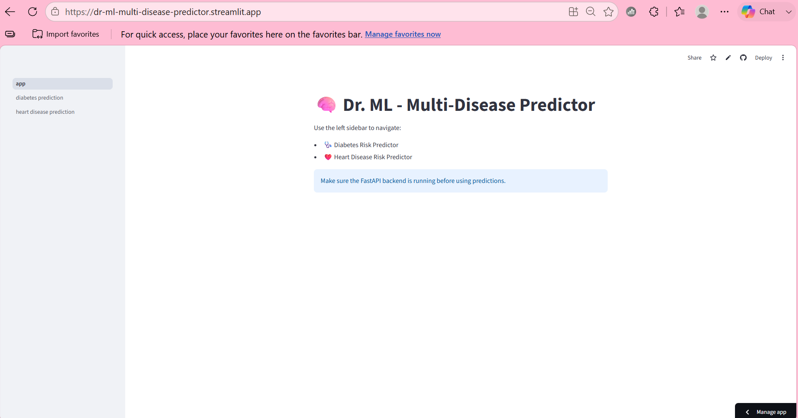
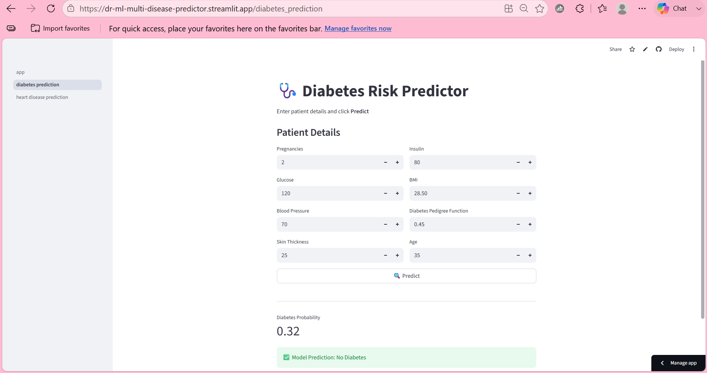
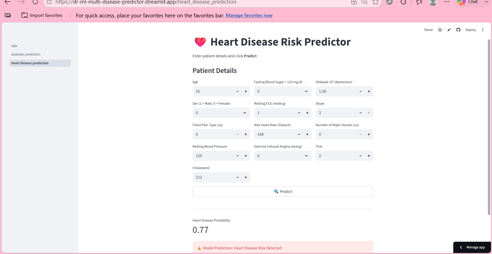
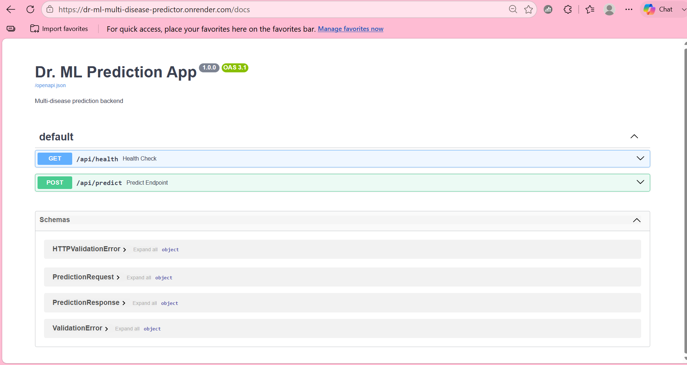

# 🩺 Dr-ML: Multi-Disease Prediction System

An end-to-end machine learning application that predicts the risk of **Heart Disease** and **Diabetes** using patient health parameters. The project follows a structured and modular architecture, covering the complete machine learning lifecycle from data preprocessing and model development to deployment using FastAPI, Render, and Streamlit.

## Live Demo
  


  🔹 **Web Application:**  
  https://dr-ml-multi-disease-predictor.streamlit.app
  
  🔹 **API Documentation (Swagger):**  
  https://dr-ml-multi-disease-predictor.onrender.com/docs

## Project Overview

Dr-ML is a multi-disease prediction system designed using a scalable and modular architecture. It includes separate machine learning pipelines for Heart Disease and Diabetes prediction while sharing a common backend API. The application provides an interactive Streamlit interface where users can enter patient information and receive real-time predictions with probability scores. The FastAPI backend is deployed on Render, and the frontend is deployed on Streamlit Community Cloud.


##  Features

- Heart Disease prediction
- Diabetes prediction
- Data cleaning and preprocessing
- Exploratory Data Analysis (EDA)
- Feature visualization
- Model comparison using multiple machine learning algorithms
- Cross-validation for robust model evaluation
- Hyperparameter tuning for model optimization
- Model serialization using Joblib
- Structured and modular project architecture
- Centralized configuration management
- FastAPI backend for serving machine learning predictions
- FastAPI backend deployed on Render
- Interactive frontend built with Streamlit
- Frontend deployed on Streamlit Community Cloud
- Real-time predictions through deployed REST APIs


## Tech used

### Programming Language

- Python

### Machine Learning

- Scikit-learn
- Pandas
- NumPy
- Joblib

### Visualization

- Matplotlib
- Seaborn

### Backend

- FastAPI
- Uvicorn

### Frontend

- Streamlit

### Deployment

- Render
- Streamlit Community Cloud

### Other Libraries

- Requests
- Pydantic
- Pydantic Settings
- python-dotenv


## Project Structure

```text
Dr-ML-Multi-Disease-Predictor/
│
├── src/
│   │
│   ├── backend/                    # FastAPI backend
│   │   ├── main.py
│   │   ├── predictor.py
│   │   └── schemas.py
│   │
│   ├── frontend/                   # Streamlit frontend
│   │   ├── app.py
│   │   └── pages/
│   │
│   ├── training/                   # Model training pipelines
│   │   ├── diabetes_training.py
│   │   └── heart_training.py
│   │
│   └── common/                     # Shared utilities and configuration
│       ├── config/
│       ├── logger/
│       └── utils/
│
├── dataset/
├── model_dir/
├── logs/
├── images/
├── requirements.txt
├── README.md
├── LICENSE
└── .gitignore
```

## Machine Learning Workflow

1. Data Collection
2. Data Cleaning
3. Data Preprocessing
4. Exploratory Data Analysis (EDA)
5. Feature Engineering
6. Data Visualization
7. Model Training
8. Model Comparison
9. Cross-Validation
10. Hyperparameter Tuning
11. Best Model Selection
12. Model Serialization
13. FastAPI Backend Development
14. Streamlit Frontend Development
15. Backend Deployment on Render
16. Frontend Deployment on Streamlit Community Cloud


## Machine Learning Models

Several machine learning algorithms were evaluated during experimentation, including:

- Logistic Regression
- Support Vector Machine (SVM)
- Decision Tree
- Random Forest
- XGBoost 

The best-performing models were selected using cross-validation and hyperparameter tuning before deployment.


## Deployment

### Backend

- FastAPI
- Render

### Frontend

- Streamlit
- Streamlit Community Cloud

The frontend communicates with the deployed FastAPI backend through REST APIs to provide real-time disease predictions.


## Screenshots

<h3> Home Page</h3>

<p align="center">
    
</p>

<h3> Heart Disease Prediction</h3>

<p align="center">
    
</p>

<h3> Diabetes Prediction</h3>

<p align="center">
    
</p>

<h3> Prediction Result</h3>

<p align="center">
    
        
</p>

<h3>📄 API Documentation</h3>

<p align="center">
    
</p>

## Running Locally

Clone the repository

```bash
git clone <repository-url>
```

Install dependencies

```bash
pip install -r requirements.txt
```

Run the backend

```bash
uvicorn src.backend.main:app --reload
```

Run the frontend

```bash
streamlit run src/frontend/app.py
```

## Future Improvements

- Add prediction models for additional diseases.
- Integrating Explainable AI (SHAP/LIME) for model interpretability.
- Implement CI/CD using GitHub Actions
- Store patient history using a secure database.
- Containerize the application using Docker.
- Deploy the application on AWS for improved scalability.
  

## Disclaimer

This project is developed for educational and demonstration purposes only. The predictions generated by the machine learning models are not intended to replace professional medical advice, diagnosis, or treatment. Always consult a qualified healthcare professional for medical decisions.

---

## Done by:-

**Hammad Hussain**

B.Tech – Artificial Intelligence & Machine Learning  
BIT Mesra
